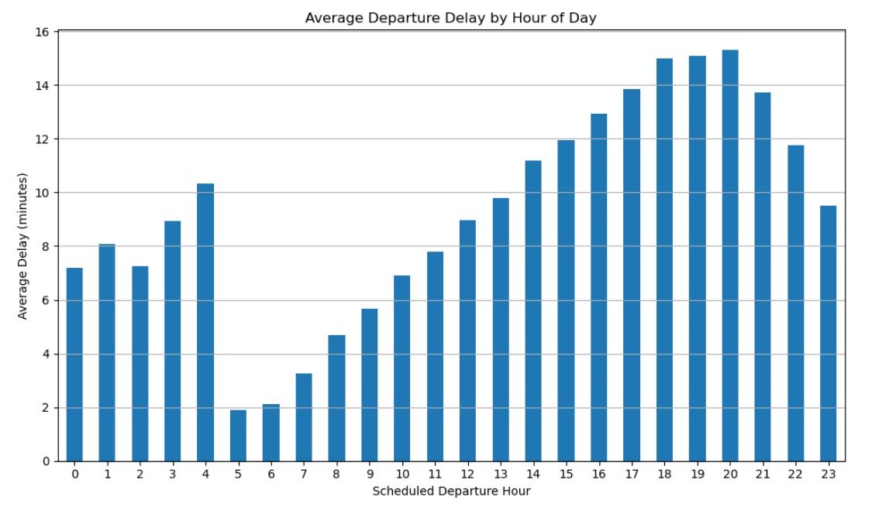
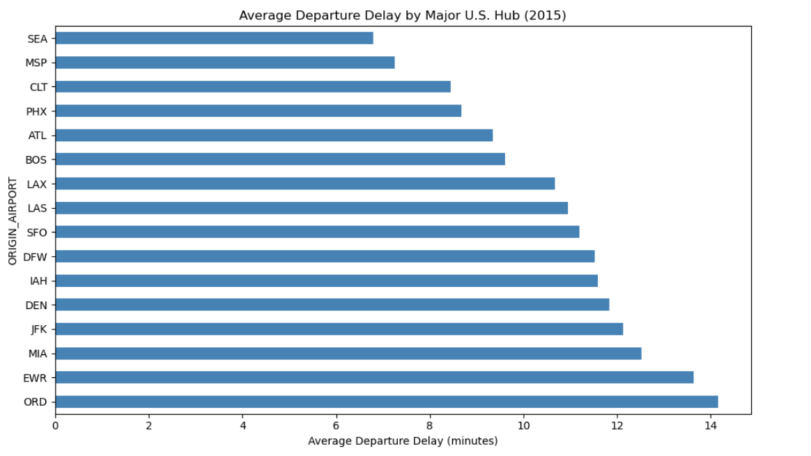
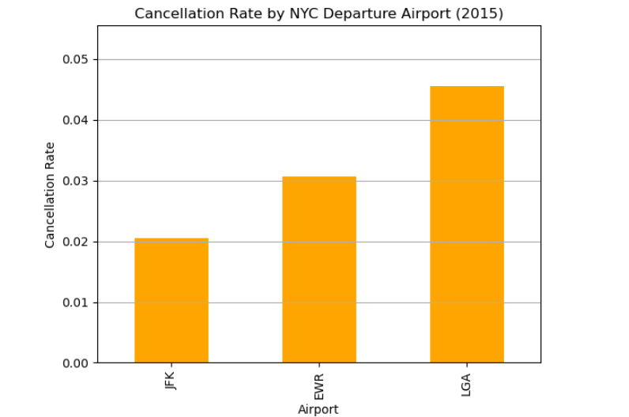

# Airline Delays and Cancellations (2015)

## Project Summary
This project analyzes U.S. domestic airline delays and cancellations in 2015 using real-world flight data. The goal was to uncover operational patterns, identify bottlenecks, and highlight airports, routes, and time periods where delays and cancellations pose the greatest operational risk. These insights can inform scheduling decisions, resource allocation, and risk mitigation strategies for airline operations and airport planning.

## Dataset
The full 2015 flights dataset is too large for GitHub’s file-size limits and is not included in this repository.
To reproduce the analysis, download the dataset locally and place it in `data/` as `flights.csv`.

*Tip: A small sample dataset can be added later for quick previews and validation.*
### Key Insights

### Major Hub Comparison:
- To enable fair comparisons, major hubs were evaluated separately from low-volume airports.

### Cancellations:
- Top causes included carrier delays, weather, NAS (airspace constraints), security, and late-arriving aircraft.
- Cancellations peaked during winter months—especially February—indicating the combined impact of weather and scheduling constraints.
- LaGuardia (LGA) exhibited a significantly higher cancellation rate (~4.5%) compared to JFK (~2%) and EWR (~3%). Among the 15 most-canceled routes, the majority involved LGA as either the origin or destination.
- Cancellation rates were evaluated alongside traffic volume to avoid misleading comparisons.

### Delay Patterns:
- Carrier-related delays were the largest contributor to total delay time, followed by late-arriving aircraft and NAS delays.
- Delays accumulated throughout the day, peaking during late afternoon and early evening (4–8 PM), consistent with network ripple effects.
- Airports with the highest average departure delays included Aspen (ASE), Eagle-Vail (EGE), Chicago O’Hare (ORD), and Trenton (TTN).
- While some small regional airports showed low delays, low traffic volume limited the reliability of those comparisons. Subsequent analysis focused on major hubs for fairer benchmarking.

### Major Hub Comparison:
- **To enable fair comparisons, major hubs were evaluated separately from low-volume airports.
- **Best Performing Hubs:** Seattle (SEA), Minneapolis (MSP), Charlotte (CLT)
- **Worst Performing Hubs:** Chicago O’Hare (ORD), Newark (EWR), Miami (MIA)

### Analytical Notes & Assumptions
- Negative delay values (early departures) were excluded from delay calculations.
- Airport and route comparisons were limited to locations with sufficient flight volume to reduce noise from rare events.
- Extreme outliers were reviewed to prevent skewing average delay metrics.

## Key Visuals

### Average Departure Delay by Hour of Day
*Average departure delays increase steadily throughout the day, peaking in the late afternoon and evening as early disruptions cascade across the network.*

---

### Average Departure Delay by Major U.S. Hub
*When controlling for flight volume, several major hubs consistently exhibit higher average departure delays, highlighting persistent operational challenges rather than isolated incidents.*

---

### Cancellation Rate by NYC Departure Airport
*Despite serving the same metropolitan area, LaGuardia (LGA) shows a markedly higher cancellation rate than JFK and EWR, underscoring how airport-specific constraints affect reliability.*

## Files Included
- `Airline_Delay_Analysis.ipynb`: Jupyter Notebook with full analysis
- `/data/`: Cleaned CSV file for analysis
- `/visuals/`: PNG images used in the notebook and for documentation
- `README.md`: This documentation

## Tools Used
- Python (pandas, matplotlib) - data cleaning, aggregation, EDA
- Jupyter Notebook - exploratory analysis and documentation
- GitHub - version control and documentation
- Power BI - planned interactive dashboard for stakeholder-facing insights

## Future Extensions
- Add Power BI dashboard
- Compare across multiple years
- Explore aircraft types and delay correlation
- Study route density and performance

